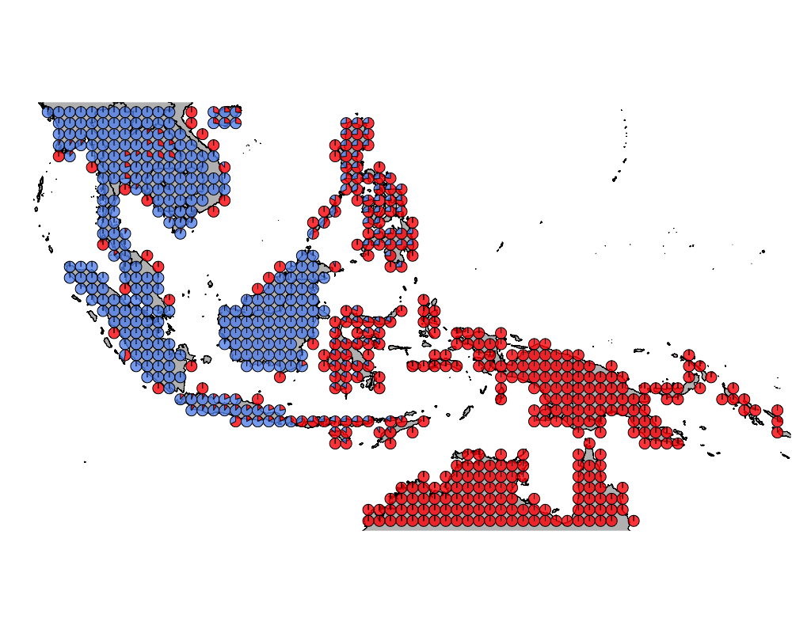
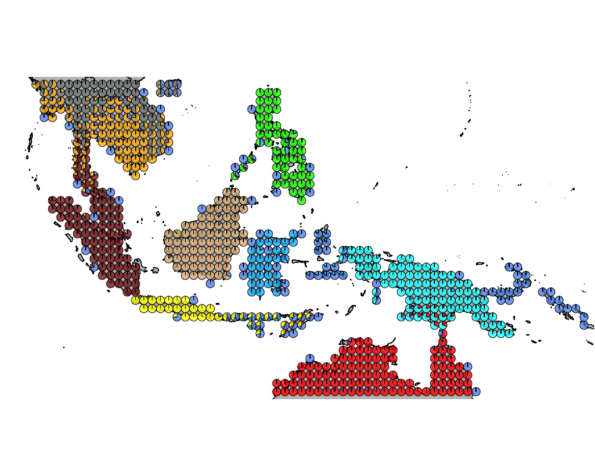

## Introduction

In this script, we investigate the birds in the lowlands of Thailand. 

## Packages

```{r setup, include=TRUE, warning = FALSE, message = FALSE}
library(methClust)
library(CountClust)
library(rasterVis)
library(gtools)
library(sp)
library(rgdal)
library(ggplot2)
library(maps)
library(mapdata)
library(mapplots)
library(scales)
library(ggthemes)

```

## Wallacea Region data

```{r}
datalist <- get(load("../data/wallace_region_pres_ab_breeding_with_seabirds.rda"))
latlong <- datalist$loc
data <- datalist$dat
if(nrow(latlong) != nrow(data)) stop("dimensions matching error")
```


## Map of Wallacea 

```{r}
world_map <- map_data("world")
world_map <- world_map[world_map$region != "Antarctica",] # intercourse antarctica

world_map <- world_map[world_map$long > 90 & world_map$long < 160, ]
world_map <- world_map[world_map$lat > -18 & world_map$lat < 20, ]


p <- ggplot() + coord_fixed() +
  xlab("") + ylab("")

#Add map to base plot
base_world_messy <- p + geom_polygon(data=world_map, aes(x=long, y=lat, group=group), colour="light green", fill="light green")

cleanup <- 
  theme(panel.grid.major = element_blank(), panel.grid.minor = element_blank(), 
        panel.background = element_rect(fill = 'white', colour = 'white'), 
        axis.line = element_line(colour = "white"), legend.position="none",
        axis.ticks=element_blank(), axis.text.x=element_blank(),
        axis.text.y=element_blank())

base_world <- base_world_messy + cleanup

base_world

```

### K = 2



### K = 10



## Thailand lowlands 

```{r}
topics_clust <- get(load("../output/methClust_wallacea_w_seabirds.rda"))
```

### Extracting enriched birds

```{r}
topics <- topics_clust[[10]]
freq <- topics$freq
which_comp <- apply(freq, 1, function(x) return(which.max(x)))
freq2 <- freq[which(which_comp==10),]
idx <- order(freq2[,10])
bird_in_10_names <- rownames(freq2)[idx]
head(bird_in_10_names)
```

### Patterns of presence absence of these birds 

```{r}
PlotAssemblageIdx <- function(name){
  dat <- cbind.data.frame(latlong, data[,name])
colnames(dat) <- c("Latitude", "Longitude", "Value")
map_data_coloured <- 
  base_world +
  geom_point(data=dat, 
             aes(x=Latitude, y=Longitude, colour=Value), size=0.5) +
  scale_colour_gradient(low = "white", high = "black") 

map_data_coloured
}

```


```{r}
ids <- c()
for(m in 1:50){
  tmp <- data[,as.character(bird_in_10_names[m])]
  ll <- length(which(tmp == 1))
  if(ll > 6) ids <- c(ids, m)
}
ids
```
```{r}
as.character(bird_in_10_names[ids[1]])
PlotAssemblageIdx(as.character(bird_in_10_names[ids[1]]))
as.character(bird_in_10_names[ids[2]])
PlotAssemblageIdx(as.character(bird_in_10_names[ids[2]]))
as.character(bird_in_10_names[ids[3]])
PlotAssemblageIdx(as.character(bird_in_10_names[ids[3]]))
as.character(bird_in_10_names[ids[4]])
PlotAssemblageIdx(as.character(bird_in_10_names[ids[4]]))
as.character(bird_in_10_names[ids[5]])
PlotAssemblageIdx(as.character(bird_in_10_names[ids[5]]))
as.character(bird_in_10_names[ids[6]])
PlotAssemblageIdx(as.character(bird_in_10_names[ids[6]]))
as.character(bird_in_10_names[ids[7]])
PlotAssemblageIdx(as.character(bird_in_10_names[ids[7]]))
as.character(bird_in_10_names[ids[8]])
PlotAssemblageIdx(as.character(bird_in_10_names[ids[8]]))
as.character(bird_in_10_names[ids[9]])
PlotAssemblageIdx(as.character(bird_in_10_names[ids[9]]))
as.character(bird_in_10_names[ids[10]])
PlotAssemblageIdx(as.character(bird_in_10_names[ids[10]]))
as.character(bird_in_10_names[ids[11]])
PlotAssemblageIdx(as.character(bird_in_10_names[ids[11]]))
as.character(bird_in_10_names[ids[12]])
PlotAssemblageIdx(as.character(bird_in_10_names[ids[12]]))
```

