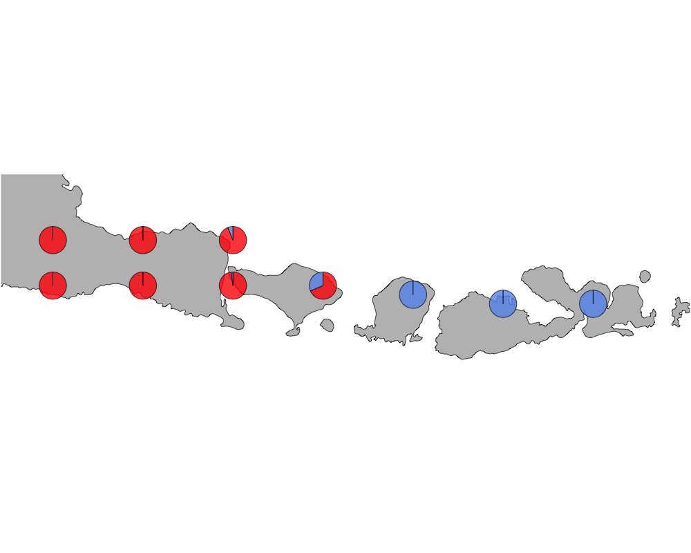
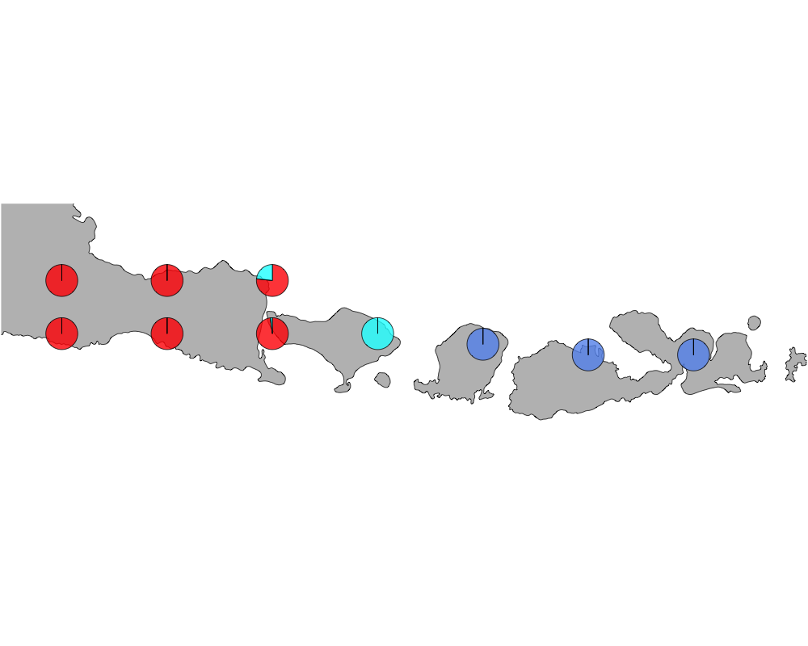
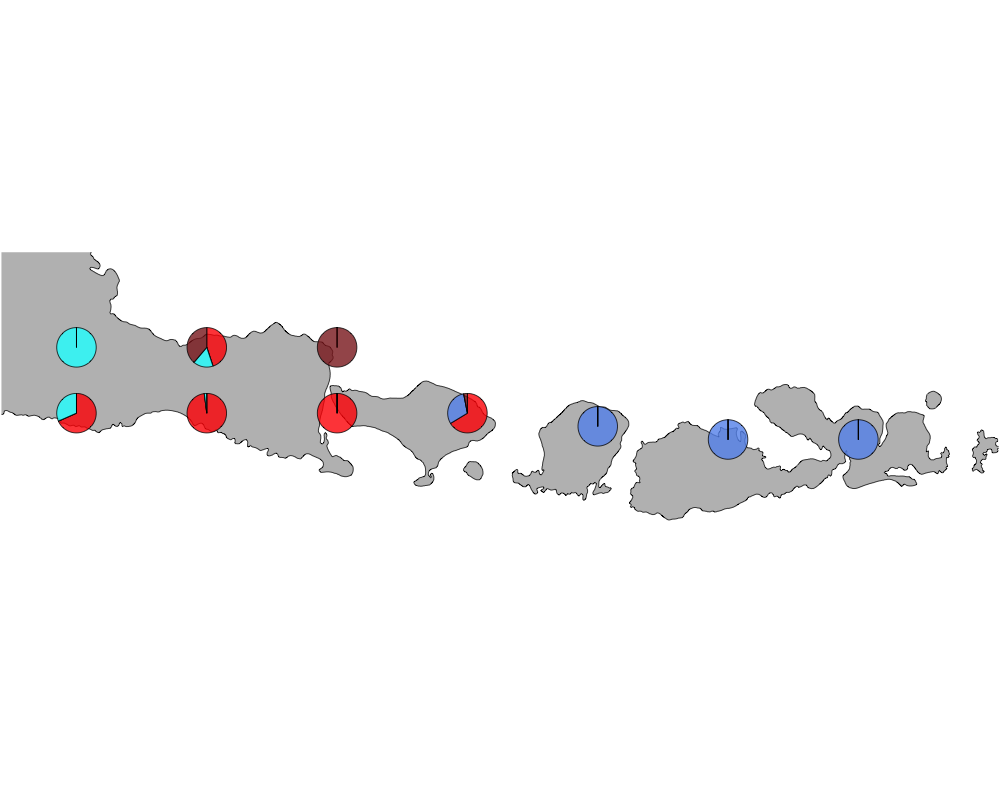

Here we observe the presence absence data of bird species in the Indonesian archipelago - comprising of Java, Bali, Lombok and Sumbawa. Lincoln (1975) observed bird counts on either
side of the Wallace line [paper](https://zslpublications.onlinelibrary.wiley.com/doi/abs/10.1111/j.1469-7998.1975.tb02238.x) and found the Western belt (Java Bali) to have a very distinct bird abundance pattern comared to the Eastern belt (Lombok and Sumbawa). We try to interpret that in the context of our Grade of Membership (GoM) model and its applications to presence absence data.

```{r setup, include=FALSE}
library(methClust)
library(rasterVis)
library(gtools)
library(sp)
library(rgdal)
library(ggplot2)
library(maps)
library(mapdata)
library(mapplots)
library(scales)
library(ggthemes)

```
Load the data

```{r}
datalist <- get(load("../data/wallace_region_pres_ab_breeding_no_seabirds.rda"))
latlong <- datalist$loc
data <- datalist$dat
if(nrow(latlong) != nrow(data)) stop("dimensions matching error")
```

Map of Java, Bali, Lombok and Sumbawa

```{r}
world_map <- map_data("world")
world_map <- world_map[world_map$region != "Antarctica",] # intercourse antarctica

world_map <- world_map[world_map$long > 112 & world_map$long < 119.5, ]
world_map <- world_map[world_map$lat > -9.3 & world_map$lat < -7.3, ]


p <- ggplot() + coord_fixed() +
  xlab("") + ylab("")

#Add map to base plot
base_world_messy <- p + geom_polygon(data=world_map, aes(x=long, y=lat, group=group), colour="light green", fill="light green")

cleanup <- 
  theme(panel.grid.major = element_blank(), panel.grid.minor = element_blank(), 
        panel.background = element_rect(fill = 'white', colour = 'white'), 
        axis.line = element_line(colour = "white"), legend.position="none",
        axis.ticks=element_blank(), axis.text.x=element_blank(),
        axis.text.y=element_blank())

base_world <- base_world_messy + cleanup

base_world

```

Extracting the birds in this region 

```{r}
idx1 <- which(latlong[,2] > -9.3 & latlong[,2] < -7.3)
idx2 <- which(latlong[,1] > 112 & latlong[,1] < 119.5)
idx <- intersect(idx1, idx2)
length(idx)
latlong2 <- latlong[idx,]
```

```{r}
birds_pa_data_2 <- data[idx, ]
birds_pa_data_3 <- birds_pa_data_2[, which(colSums(birds_pa_data_2)!=0)]
```

Applying methclust presence absence Grade of Membership model to the presence absence data

```{r echo=TRUE, eval=FALSE}
topics_clust <- list()
topics_clust[[1]] <- NULL
for(k in 2:4){
  topics_clust[[k]] <- meth_topics(birds_pa_data_3, 1 - birds_pa_data_3, 
            K=k, tol = 0.01, use_squarem = FALSE)
}
save(topics_clust, file = "../output/methClust_java_bali_lombok.rda")

```
```{r}
topics_clust <- get(load("../output/methClust_java_bali_lombok.rda"))
```

```{r}
color = c("red", "cornflowerblue", "cyan", "brown4", "burlywood", "darkgoldenrod1",
          "azure4", "green","deepskyblue","yellow", "azure1")
intensity <- 0.8
latlong3 <- latlong2
latlong3[which(latlong3[,2] == -7.5), 2] = -7.8
latlong3[which(latlong3[,2] == -8.5), 2] = -8.3
latlong3[8,2] = -8.4
latlong3[9,2] = -8.5
latlong3[10,2] = -8.5

for(k in 2:4){
  png(filename=paste0("../output/Java_Bali_Lombok/geostructure_birds_", k, ".png"),width = 1000, height = 800)
map("worldHires",
    ylim=c(-9.3,-7.1), xlim=c(112,119.5), # Re-defines the latitude and longitude range
    col = "gray", fill=TRUE, mar=c(0.1,0.1,0.1,0.1))
lapply(1:dim(topics_clust[[k]]$omega)[1], function(r)
  add.pie(z=as.integer(100*topics_clust[[k]]$omega[r,]),
          x=latlong3[r,1], y=latlong3[r,2], labels=c("","",""),
          radius = 0.15,
          col=c(alpha(color[1],intensity),alpha(color[2],intensity),
                alpha(color[3], intensity), alpha(color[4], intensity),
                alpha(color[5], intensity), alpha(color[6], intensity),
                alpha(color[7], intensity), alpha(color[8], intensity),
                alpha(color[9], intensity), alpha(color[10], intensity),
                alpha(color[11], intensity))));
dev.off()
}

```


The geostructure plot for K=2.






The bird species separating Java and Bali from Lombok and Sumbawa for K=2.

```{r}
topics_freq <- topics_clust[[2]]$freq
diff <- topics_freq[,2] - topics_freq[,1]
par(mfrow=c(1,2))
plot(diff[order(diff, decreasing = TRUE)], col = "red")
plot(diff[order(diff, decreasing = FALSE)], col = "red")
```

Birds to the east of the Wallace line (blue cluster)

```{r}
rownames(topics_freq)[order(diff, decreasing = TRUE)[1:50]]
```

Birds to the west of the Wallace line (red cluster)

```{r}
rownames(topics_freq)[order(diff, decreasing = FALSE)[1:50]]
```
